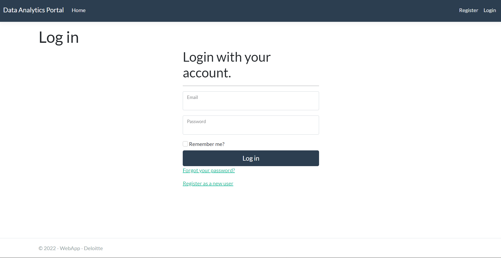
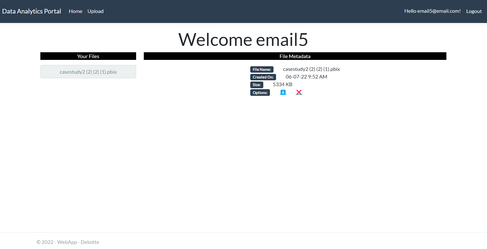
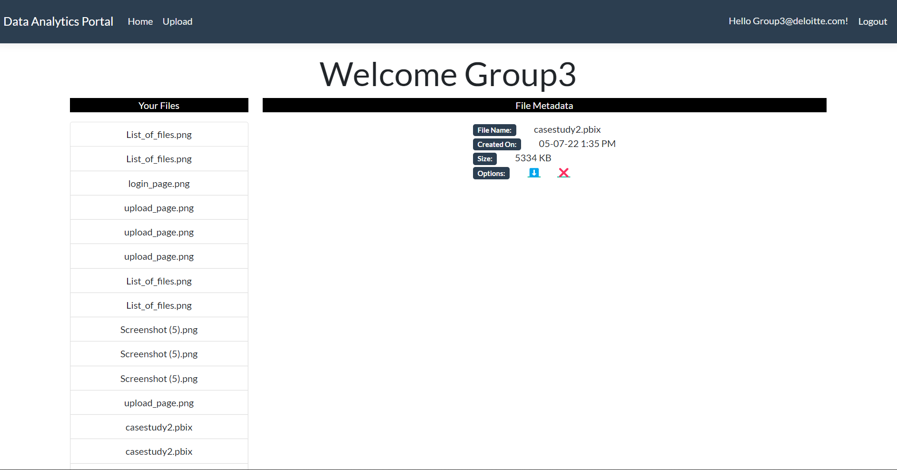
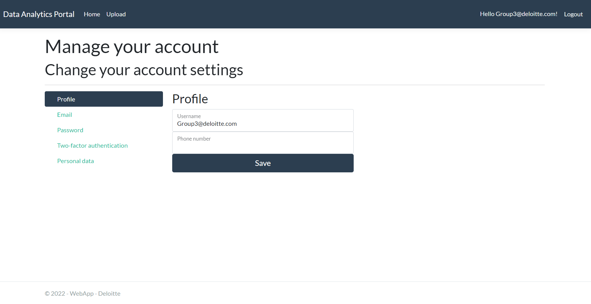

## Deloitte Case Study
---

### Introduction
This is a casestudy for the deloitte summer internship.

### Problem Statement
A Web Portal that can be used to upload files and display the metadata to the user
* User login/register
* Upload page
* Metadata display

### Features Made
* User login/register
* Upload files
* Delete files
* Admin Page
* Metadata display

### Installation
> * git clone https://github.com/reach-the-sky/Deloitte-Case-Study
* Install dotnet version 6
* Use Visual Studio 2022 
* Update the database connection strings **"AuthenticationDBConnection"** and **"FileDBConnection"** in **appsettings.json** file
> * Add-Migration "Initial Commit" -Context AuthenticationDbContext
> * update-database -Context AuthenticationDbContext
> * Add-Migration "Initial Commit" -Context FilesDbContext
> * update-database -Context FilesDbContext

or

Instead of migration you can import the .mdf files

### Images

Thank you😁.